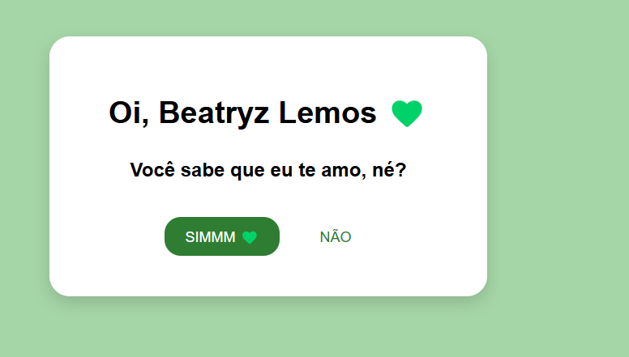

# 💚 Pedido Interativo

Projeto web desenvolvido como prática inicial de HTML, CSS e JavaScript.

A proposta foi criar uma página interativa com uma sequência de perguntas, botões com comportamentos diferentes e uma animação final.

## 🖥️ Preview do projeto

## 🚀 Tecnologias utilizadas

- HTML5
- CSS3
- JavaScript
- GitHub Pages
- ## 🌐 Projeto online

O projeto está publicado através do GitHub Pages.

👉 [Clique aqui para acessar o Pedido Interativo](https://gabrielleduraes.github.io/pedido-interativo/)

## ✨ Funcionalidades

- Sequência interativa de perguntas
- Alteração dinâmica do conteúdo com JavaScript
- Botão "NÃO" com movimento aleatório
- Eventos para mouse e dispositivos móveis
- Animação de corações ao finalizar
- Layout responsivo para computador e celular

## 🧠 Aprendizados

Durante o desenvolvimento deste projeto, pratiquei conceitos fundamentais de desenvolvimento web, como HTML, CSS e JavaScript.

Também trabalhei com manipulação do DOM, eventos, condicionais, funções, responsividade e debugging, além de realizar a publicação do projeto utilizando GitHub Pages.
